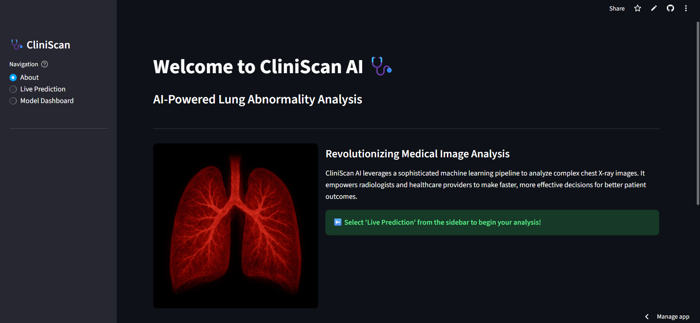

# 🩺 CliniScan AI: AI-Powered Lung Abnormality Detection

[](https://cliniscan-lung-abnormality-detection-yogithaprasad.streamlit.app/)

An end-to-end deep learning portfolio project demonstrating a complete pipeline for detecting and classifying abnormalities in chest X-ray images, built with Python, YOLOv8, TensorFlow, and deployed as an interactive web application with Streamlit.

---

## 🎥 Live Demonstration

The application is deployed and publicly accessible. Click the image below to watch a full video walkthrough of the application's features and functionality.

[](assets/demo.mp4)

**[Interact with the Live Application Here](https://cliniscan-lung-abnormality-detection-yogithaprasad.streamlit.app/)**

---

## 📋 Table of Contents
- [About The Project](#about-the-project)
- [Key Features](#key-features)
- [Methodology: The AI Pipeline](#methodology-the-ai-pipeline)
- [Technology Stack](#-technology-stack)
- [Project Structure](#-project-structure)
- [How to Run Locally](#-how-to-run-locally)
- [Development Milestones](#-development-milestones)

---

## About The Project

CliniScan AI is a proof-of-concept platform designed to showcase the power of deep learning in medical imaging. The primary goal is to provide an intuitive tool that assists in the analysis of chest radiographs by identifying and localizing potential pathological findings.

This project was developed to tackle the challenges of working with complex medical data and to build a full-stack AI application from data collection to final deployment.

**This tool is for educational and demonstration purposes only and is not a certified medical device intended for real-world diagnostic use.**

## Key Features
- **Dual-Model System:** Utilizes two distinct AI models for a comprehensive, two-stage analysis.
- **Interactive Web Interface:** A user-friendly application built with Streamlit that allows for easy image upload and interaction.
- **Model Interpretability:** Implements Grad-CAM to generate heatmaps, providing visual insight into the classification model's decision-making process.
- **Flexible Detection:** Allows users to switch between a general single-class detector and a more specific multi-class detector to compare results.
- **Performance Dashboard:** A dedicated page to display and review the performance metrics (like Confusion Matrices and training data) for all integrated models.
- **Downloadable Reports:** Users can download a text-based summary of the analysis for any given X-ray.

## Methodology: The AI Pipeline

The application uses a sequential, two-stage process for analysis:

1.  **Classification:** A ResNet50-based Convolutional Neural Network (CNN) first analyzes the entire image to determine if it is **'Normal'** or **'Abnormal'**. This acts as an initial, high-level screening.
2.  **Detection:** If the image is deemed 'Abnormal', a **YOLOv8** object detection model is then used to draw bounding boxes around the specific regions of interest that it identifies as potential abnormalities.
3.  **Visualization:** For all 'Abnormal' classifications, a **Grad-CAM (Gradient-weighted Class Activation Mapping)** heatmap is generated. This visualization highlights the pixels the classification model focused on most, providing insight into its decision-making process.

## 🛠️ Technology Stack

- **Backend & Web Framework:** Python, Streamlit
- **Object Detection:** PyTorch, Ultralytics YOLOv8
- **Classification:** TensorFlow, Keras (ResNet50)
- **Data Handling & Image Processing:** Pandas, NumPy, OpenCV, Pillow
- **Deployment:** Streamlit Community Cloud
- **Version Control:** Git & GitHub (with Git LFS for large model handling)

## 📂 Project Structure

This repository is organized into a professional, modular structure to separate concerns and improve maintainability:
- `/app.py`: The main Streamlit application script that handles the UI and page routing.
- `/src/`: Contains helper modules, such as `utils.py` for visualization functions.
- `/models/`: Stores the final, trained model weights (`.pt` and `.h5` files).
- `/assets/`: Contains static assets like images for the UI and all model performance charts.
- `/scripts/`: Includes scripts for one-time tasks like training the models.
- `/.streamlit/config.toml`: Configuration file for the Streamlit dark theme.
- `/requirements.txt`: A list of all necessary Python packages for easy setup.

## 🚀 How to Run Locally

To run this application on your local machine, follow these steps:

1.  **Clone the repository:**
    ```bash
    git clone https://github.com/yogithaprasad/CliniScan-Lung-Abnormality-Detection.git
    cd CliniScan-Lung-Abnormality-Detection
    ```
2.  **Install dependencies:**
    ```bash
    pip install -r requirements.txt
    ```
3.  **Run the Streamlit application:**
    ```bash
    streamlit run app.py
    ```

## 📈 Development Milestones

This project was developed through a series of key milestones:
- **Milestone 1: Data Preprocessing & Setup:** Processed and cleaned two distinct chest X-ray datasets, converting annotations to a unified format.
- **Milestone 2: Model Training & Experimentation:** Trained and compared multiple YOLOv8 and ResNet50 models to identify the best performers for integration.
- **Milestone 3: Application Development:** Built the core Streamlit application, integrating the best-performing classifier and detectors.
- **Milestone 4: Final Polish & Deployment:** Refined the UI/UX, added professional features like Grad-CAM and downloadable reports, and deployed the final application to Streamlit Community Cloud.